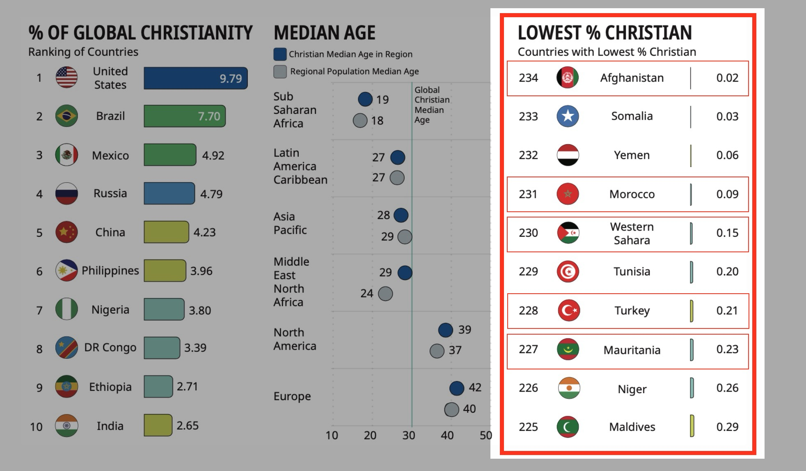
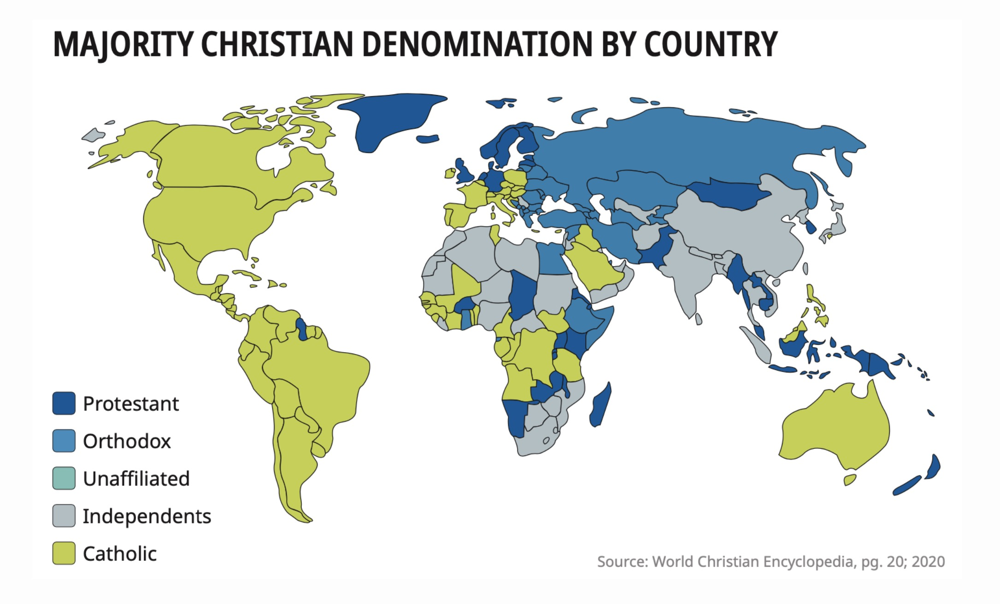
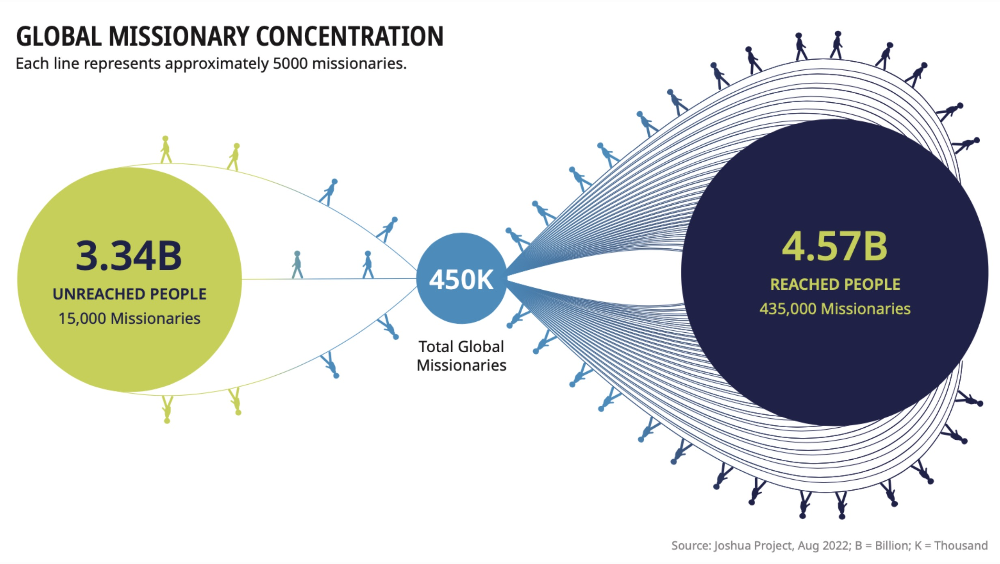

# 세계 선교 현황

### 1. 예수님의 지상 대명령 (The Great Commission)
> 예수께서 나아와 말씀하여 이르시되 하늘과 땅의 모든 권세를 내게 주셨으니
> 그러므로 너희는 _**가서**_ **모든 민족을 제자로 삼아** 아버지와 아들과 성령의 이름으로 **_세례를 베풀고_**
> 내가 너희에게 분부한 모든 것을 **_가르쳐 지키게 하라_** 볼지어다 내가 세상 끝날까지 너희와 항상 함께 있으리라 하시니라 - 마태복음 28:18-20

1. _**가서**_: 아직도 **복음을 들을 기회조차 없는 사람들(미전도 종족)** 이 세계 인구의 약 40% (33억 명)
2. **모든 민족을 제자로 삼아**: 언어, 문화, 종교를 공유하는 집단(종족) 단위로 예수님의 가르침으로 제자화
3. **세례를 베풀고 가르켜 지키게 하라**: 그리스도와의 연합, 삶의 변화, 공동체 형성, 지속적인 양육 필요

위의 모든 요소(가서 → 제자 삼고 → 세례 주고 → 가르쳐 지키게 함)는 단순한 “전도”나 “이벤트”로는 불가능하고, 반드시 공동체로 세워지는 교회가 필요.
선교는 단순한 복음 전도가 아니라 현지에 지역교회를 세우는 **교회 개척 (Church Planting)** 임

**👉 선교는 교회 개척이다 ✝️**

### 2. 세계 기독교 현황
복음화율이 낮은 국가에 관심과 노력이 필요: 선교 자원(선교사, 재정, 기도)의 재배치가 요구됨

개신교 중심의 시야를 벗어나, 더 넓고 포용적인 신학적 시야 필요 🌍
* 신학적 중심은 분명하되, 선교적 적용에서는 열린 태도를 갖는 것
* 신학의 **기본 진리(복음, 삼위일체, 성육신 등)** 는 분명하게 지키며, 다양한 교파(정교회, 가톨릭, 오순절 등)들과 협력
* 지금은 다양한 문화간의 상호 선교 시대이므로, 교파보다 복음을 어떻게 증거할 것인가가 더 중요
* 신학의 확장과 균형
  * 개신교의 복음 중심, 성경의 권위 기반위에, 가톨릭의 사회적 실천, 정교회의 영성, 오순절의 성령 이해 등을 상호 존중하고 이해하려는 신학적 포용력이 필요

 

오늘날 약 17,000 종족 중 약 **7,000 종족(약 40%)** (주로 이슬람, 힌두교, 불교, 무속 중심) 이 여전히 복음을 듣지 못한 상태  
➡️ _아직 한 번도 예수님의 이름조차 들어보지 못한 종족들을 향한 의식적이고 집중적인 접근 필요_

### 3. 세계 기독교 성장

* 명령은 **불변(不變)**, 상황은 **만변(萬變)**: 하나님의 명령은 시대를 초월해 항상 유효하지만, 그것을 실천하기 위해서는 상황의 변화에 민감하게 반응해야 함
* 우리는 시대의 변화에 맞도록 선교를 관찰, 분석하여 전략에 맞추어 진행을 하지만, 하나님의 일하심은 우리의 예상을 초월하심을 명심
* **인구증가 속도 > 복음화 속도**
  * 미전도 지역(아프리카, 남아시아, 중동 등)에서의 빠른 인구 증가 속도에 발맞추어 복음화의 전략적인 집중과 투자가 필요
* **복음주의는 10% 미만**
  * 복음주의(Evangelical)란 복음 중심의 회심, 성경의 권위, 십자가 중심의 구속 신앙을 일컬음
  * 세상에는 “기독교 문화권”은 넓지만, 진정한 복음 중심의 신앙을 가진 사람은 소수
  * 양적인 성장을 넘어, 질적인 성장, 즉 복음 중심의 회심과 지속적인 제자화 훈련 및 양육 필요

### 4. 세계 선교사 파송 현황
* 과거의 선교는 주로 **서구(북미, 유럽)** 에서 **비서구권(아시아, 아프리카, 라틴아메리카)** 으로 복음을 보내는 **단일 중심적(Monocentric)** 구조였으나, 이제는 **다중심적인(Polycentric)** 구조로 바뀌어감
* **광범위한 선교관 필요**: 문화간 선교(Cross-cultural Mission), 난민 선교(Refugee Mission), 도시 선교(Urban Mission), 직업 선교 (Business as Mission - BAM), 디지털 선교(Digital Mission) 등등

| 구분 | 전통적 선교 (Monocentric Mission) | 폴리센트릭 선교 (Polycentric Mission) |
|-----|--------------------------------|-----------------------------------|
| 중심 | 서구 (유럽, 북미 중심) | 다수의 중심 (전 세계 교회) |
| 방향 | 서구 → 비서구 | 모든 나라 → 모든 나라 |
| 특징 | 단일문화 중심, 개척 선교 | 다문화 이해, 협력 선교, 통전적 접근 |
| 표어 | _**"서구에서 세계로"**_ | _**"온 열방에서 온 열방으로"**_ |

* 대부분의 선교사들이 이미 복음이 들어간 지역으로 지속적으로 파송되고 있음 🤦‍♂️
  * 전체 선교사의 약 _**3%만이**_ 아직 **복음을 한 번도 들어보지 못한 미전도 종족(UPG)** (세계 인구의 약40%) 에게 파송되고 있음 😢
* **선교사 파송의 재조정 필요** 🔄
  * 하나님 나라의 관점에서 **‘선교사가 제일 필요한 지역’** 을 기준으로 파송을 재조정해야 함

### 5. 한국 기독교 및 선교사 파송 현황
선교사 고령화 👴👵 [(선교사 평균 연령 53.9세)](https://www.goodnews1.com/news/articleView.html?idxno=445341) 및 아시아 파송 집중화 [(2024년 신규파송 65% 아시아로)](https://m.pckworld.com/article.php?aid=10593339539#:~:text=%EC%95%84%EC%8B%9C%EC%95%84%EA%B0%80%2065.2%25) 가 지속됨

**대응 방안 및 과제**
* **젊은 세대 선교사 동원**: 20~30대 선교사 비율이 낮아지고 있으므로, 청년층의 선교 참여를 촉진하기 위한 전략적 접근이 필요
> [!TIP]
> 초대교회 선교 방향성 8번 [선교적 교육부](../../README.md#선교적-교육부)
 

* **은퇴 선교사 지원 체계 구축**: 은퇴 선교사들의 경험과 지혜를 활용할 수 있는 방안을 마련하고, 은퇴 이후의 삶을 지원하는 체계 구축 필요​
> [!TIP]
> 초대교회 선교 방향성 4번 [파송 선교사를 향한 교회의 책무](../../README.md#파송-선교사를-향한-교회의-책무)
 

* **선교 지역의 다양화**: 아시아 지역에 집중된 선교사 파송을 재조정하여, 전 세계의 복음화를 위한 균형 잡힌 선교 전략 수립 필요
> [!TIP]
> 초대교회 선교 방향성 1번 [선교 단체와의 협력](../../README.md#선교적-협력)
 

### 6. 미국 기독교 현황

### 7. 해석과 적용 (The Great Vision)
**지상 대명령** (The Great Commission) 을 실현하는 **선교 대계획** (The Great Vision) 수립
> "세계 기독교의 미래는 아프리카에 있다" - 필립 젠킨스(Philip Jenkins)

> "1세기부터 지금까지 세계 선교의 중심에는, 지역 교회(local churches) 와 선교 단체(mission agencies)의 협력이 있어왔다." - Yaw Perbi & Sam Ngugi

> "예수님은 여전히 왕이시다. 그분의 선교는 반드시 성취될 것이다." – 제인 프랫 (Zane Pratt)

