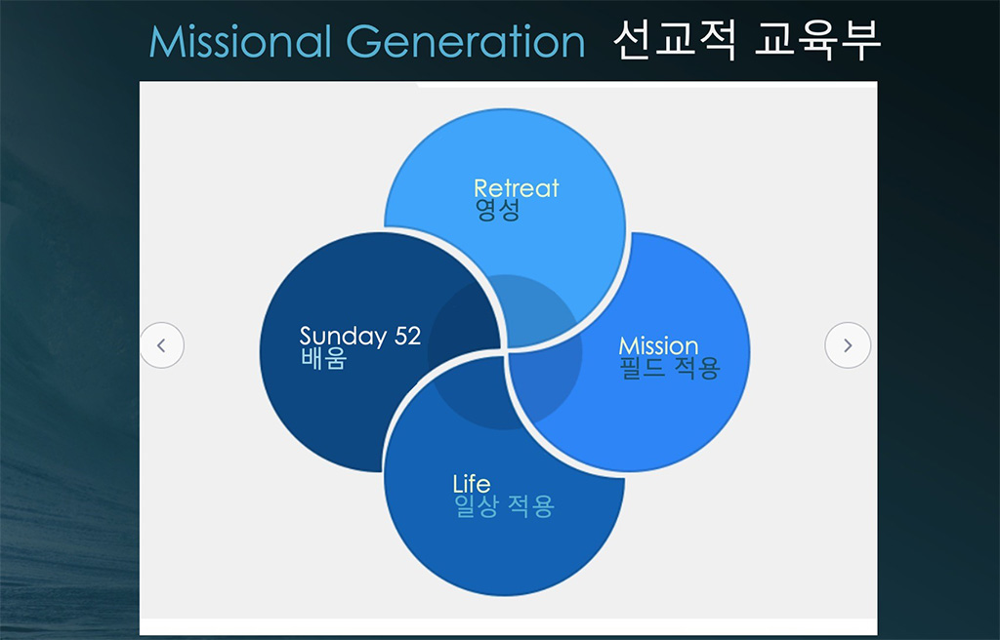

> [!NOTE]
> 이 문서는 많은 분들이 지속적으로 참여하여 누구나 볼 수 있는 **"살아 있는 문서"**(Living Document)를 만드는 것을 목표로 합니다. 하나님의 말씀이 기록되어 우리에게 전해진 것처럼, 교회의 사명인 선교에 대한 시행착오와 개선 방향을 끊임없이 기록하여 나누고자 합니다. 우리가 겪었던 광야의 시대를 다음 세대가 반복하지 않도록, 그리고 오직 믿음으로 여리고 성을 함락시키며 하나님의 나라를 확장하는 일에 쓰일 수 있도록, 많은 분들의 경험과 제안을 일회성으로 모으는 것이 아니라 지속적으로 업데이트하여 **선교의 생명**이 담긴 살아 숨 쉬는 문서를 만들고자 합니다. 이 문서는 그러한 실험적인 시도의 일환임을 밝힙니다.

-----

뉴저지 초대교회 선교전략
=======

## 교회의 존재 이유

* 예배
* 증거 (선교, 구제, 긍휼)  

## 뉴저지초대교회 선교방향성
#### 1. 뉴저지초대교회의 선교는 **[협력](#선교적-협력)** 을 통해 이뤄가며, 파송 및 협력선교사 40유닛과 전략적으로 동역하며, **[필드 구조를 갖춘 선교 단체](#필드구조를-갖춘-선교-단체)** 와 협력을 추진한다.

#### 2. 파송 선교사는 교회에 주신 비전에 선교사가 협력하는 것이고, 협력 선교사는 선교사에게 주신 비전을 교회가 지원하는 것을 원칙으로 한다.

#### 3. Accountability의 중요성을 인식하여 우리와 협력하는 파송/협력 선교사들은 **[사역적, 재정적, 언어적 책무](#선교사의-3가지-책무)** 를 가지며, 정기적으로 교회에 **[보고할 의무](02.사역보고서/README.md)** 를 이행한다.

#### 4. Accountability의 중요성은 교회에게도 적용되며, 교회는 파송 선교사들의 **[영적, 재정적, 정서적, 사역적, 교육 및 훈련 차원 뿐 아니라, 귀국 및 재적응을 위한 책무](#파송-선교사를-향한-교회의-책무)** 를 성실히 이행한다.

#### 5. 향후 10년 안에 점차적으로 지금의 파송/협력 선교사들을 **[필드구조를 갖춘 선교 단체](#필드구조를-갖춘-선교-단체)** 에 소속된 선교사들로 바꾸어 나간다.

#### 6. 교회는 장기 선교사 **40유닛**을 파송할 수 있도록 목양적 돌봄과 지원을 강화한다.

#### 7. 파송 선교사를 보낼 때에는 **[네비우스 선교 방식](#네비우스-선교-방식)**(자립, 자전, 자치)을 적용하고, 온정주의로 인한 실패를 답습하지 않도록 하며, 현지 그리스도인들에게 리더십을 이양할 수 있도록 준비한다.

#### 8. **[선교적 교육부](#선교적-교육부)** 비전을 이루기 위해 Dew Ministry 및 교육부 학생들의 단기선교 참여를 확대해 나간다.

#### 9. 전략적으로 준비되고 기존에 맞게 훈련된 성도들이 단기 선교에 참여함으로써 단순한 숫자적인 증가를 지양하고 **다음 세대**가 더 많이 선교에 참여할 수 있도록 지원한다.

#### 10. 모든 단기선교 참여자는 반드시 훈련에 성실히 참여해야 하며, 실제적인 훈련이 될 수 있도록 잘 준비된 훈련 프로그램을 마련한다.

#### 11. 모든 단기선교팀이 **[3-3-3 년 계획](#3-3-3-년-계획)** 을 전략적으로 수립하여, 일반 성도들도 단기선교를 매년 참석하면 장기적 선교의 목표를 이룰 수 있도록 한다.

#### 12. 우리 교회에 있는 여러 분야의 전문인들이 상시적으로 선교에 참여할 수 있는 시스템을 개발하고 운영한다.

---
 

### 선교적 협력
 * **파송 선교사**: 교회에 주신 비젼에 선교사가 협력 
 * **협력 선교사**: 선교사에게 주신 비젼에 교회가 협력

초대교회는 **쏘달리티(Sodality)** 와 **모달리티(Modality)** 의 협력을 추구한다. **[필드 구조를 갖춘 선교 단체](#필드구조를-갖춘-선교-단체)** 와 협력하여 장기 선교사를 파송하고, 후원하고, 연결하는 구조로 나아간다

| 구분       | Sodality (쏘달리티)             | Modality (모달리티)             |
|-----------|-------------------------------|-------------------------------|
| 구조       | 선교 구조 (선교단체)                | 목양 구조 (지역교회)            |
| 성경적 모델 | 바울과 바나바의 선교팀              | 안디옥교회, 예루살렘교회           |
| 주된 사역  | 경계를 넘는 복음 전파, 교회 개척     | 예배, 양육, 성도의 목양          |
| 현대 적용  | 선교단체 (Frontiers, OM, OMF 등)   | 파송교회, 지역교회              |
 

### 선교사의 3가지 책무

선교사 자신의 역할과 책임을 충실히 이행하며, 행동과 결정에 대해 누구에게나 설명 할 수 있고, 그것이 올바르게 이루어지고 있는지에 대한 평가를 받아들이는 것.

1. **사역적 책무** (보고의 책무, 감독을 받겠다, 성경적 근거 - 행14:26-28)
   * 선교사는 정기적으로 교회에 [사역 보고](./02.사역보고서/README.md) 를 해야함
   * 필드 디렉터의 감독하에 사역 진행

2. **재정적 책무**
   * 개인통장 후원 금지 (선교 단체를 통한 후원)
   * 재정 투명의 원칙: 선교사의 전문직업에서 수익 발생시 선교 단체에 보고

3. **언어적 책무**
   * 첫 임기 2년은 언어습득에 매진
   * 사영리를 설명하여 전달할 수 있는 정도  
 

### 파송 선교사를 향한 교회의 책무 

1. 영적 지원 (기도, 영적 돌봄)
2. 재정 지원 (정기적 지원, 특별 사역 지원, 긴급 지원)
3. 신체적, 정서적, 심리적 돌봄 지원 (안식년 프로그램, 상담, 자녀 및 가족 돌봄)
4. 동역 지원 (단기 선교팀 파견, 비젼 트립)
5. 교육 및 훈련 (사전 훈련, 정기적 재훈련)
6. 귀국 및 재적응 지원 (보험 및 은퇴연금)  
 

### 필드구조를 갖춘 선교 단체

1. **지역 중심의 조직**  
선교 활동이 이루어지는 특정 지역이나 국가를 중심으로 선교사를 배치하고, 지역의 특성과 문화적 배경에 맞추어 구성된 선교 조직

2. **현장 중심적 결정**  
본국에서 중요 결정을 내리는 대신 현장의 필요에 따라 신속하게 결정할 수 있도록 현장 책임자에게 자율성과 책임을 부여

3. **팀 중심의 협력**  
선교사는 현장에서의 팀을 이루어 사역하며, 팀 내에서 역할을 분담하고 서로의 사역을 보완하는 구조로 운영

4. **지원과 관리 기능**  
선교단체의 현장 조직은 선교사들의 생활, 의료, 행정, 재정 관리 등을 위한 지원 부서를 두어 운영

5. **본부와 현장의 연결**  
필드 책임자(Field Director)는 현장의 상황을 본부에 전달하고 본부의 정책과 비전을 현장에 반영하는 중간 연결자 역할 감당  
 

### 파송 선교사를 세우는 일 

* 동기의 문제 – 주관적 부르심을 객관적 절차를 통해 소명.  

**4가지 체크 포인트**

1. 본교에서의 인터뷰 – 소명, 자질, 역량 + [선교사의 3가지 책무](#선교사의-3가지-책무) 를 성실히 이행할 것인가?
2. 선교지 [인턴십](./01.선교사훈련/README.md#internship) 사역 후 현지 선교사의 평가
3. 재정 확인 – 기준 금액의 85%가 채워져야 함
4. 의료 확인  
 

### 네비우스 선교 방식

* **‘자립’(自立, self-supporting)**: 토착 교인이 토착 교회 목회자의 생활비와 교회 운영을 책임. 신자들이 스스로 마련한 예배당을 소유한다
* **‘자전’(自傳, self-propagation)**: 토착인이 토착인에게 전도. 모든 신자는 배우면서 가르친다
* **‘자치’(自治, self-governing)**: 토착 교회 문제를 토착 교인들이 처리. 선임된 리더 그룹에 의해 인도하게 한다

> [!TIP]
> [네비우스 선교 방식](https://encykorea.aks.ac.kr/Article/E0076564)

**선교를 위해선 모든 것을 쏟아 부어야 한다. 동시에, 눈물을 흘리며 도와주지 않아야 한다.**  
 

### 선교적 교육부

* 52주의 주일학교 배움과 수련회를 통한 영성 훈련을 넘어, 학생 위주의 선교프로그램에 참여해 적용해보고, 일상으로 돌아와서도 내삶에 적용을 하는 일련의 흐름이 반복될 때, 이 4가지 요소가 결국 하나의 원으로 통합되는 삶을 이루어 내는 것이 목표

 

### 3-3-3 년 계획

* 단기선교의 전략화 (공연 프로그램 보다는 선교지 언어와 문화를 배워 선교적 삶이 되도록)
* 3번의 단기선교 방문으로 이룰 수 있는 중기목표를 수립
* 3번의 중기목표 달성을 통한 장기선교와 버금과는 결과를 이룰 수 있는 목표 수립
* 반복되는 단기선교지만 똑같은 반복이 아닌, 매년 하나씩 쌓아가는 벽돌이 되어 성벽 재건을 이루어 예배가 드려지는 교회가 되도록
* 큰 비젼의 장기 계획안에서 각각의 단기선교가 어떠한 의미를 가지며 성과를 이루었는지 확인 가능한 목표 수립  
 

### [장기선교사 선발 및 훈련과정](./01.선교사훈련/README.md)  
 

### [초대교회 선교사역원 조직도](30.선교사역원/README.md)  
 
